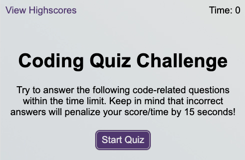
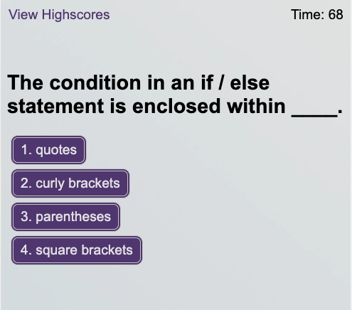
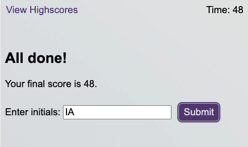

# quiz-app

[Deployed Link Here](https://iqbalahmadi.github.io/quiz-app/)

  

## Description 
This repo provides a timed quiz on JavaScript fundamentals that stores high scores. 

## Built With

- HTML
- CSS
- JavaScript

## Usage

- When you click the start button
- Then a timer starts and you are presented with a question
- When you answer a question
- Then you are presented with another question
- When you answer a question incorrectly
- Then time is subtracted from the clock
- When all questions are answered or the timer reaches 0
- Then the game is over
- When the game is over
- Then you can save your initials and your score

## Screenshot of the Page

The following image shows the website's current state

***

***

  

